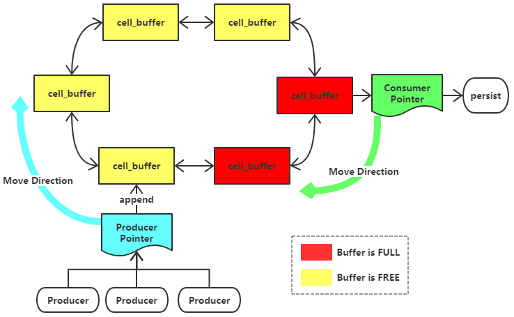
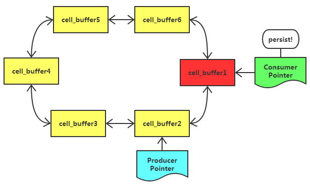
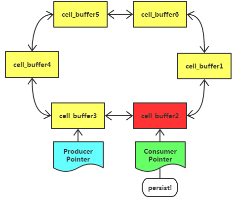
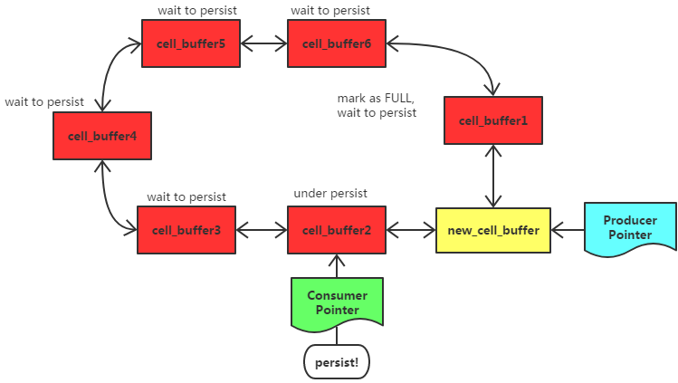

## RING LOG
>作者：李琛轩
 
### 简介
RING LOG是一个适用于C++的异步日志， 其特点是**效率高（每秒支持125+万日志写入）、易拓展**，尤其适用于**频繁写日志的场景**

**效率高：**建立日志缓冲区、优化UTC日志时间生成策略

**易拓展：**基于双向循环链表构建日志缓冲区，其中每个节点是一个小的日志缓冲区

而：
传统日志：直接走磁盘
而“基于队列的异步日志”：每写一条日志就需要通知一次后台线程，在频繁写日志的场景下通知过多，且队列内存不易拓展

### 工作原理
#### 数据结构
Ring Log的缓冲区是若干个`cell_buffer`以双向、循环的链表组成
`cell_buffer`是简单的一段缓冲区，日志追加于此，带状态：
- `FREE`：表示还有空间可追加日志
- `FULL`：表示暂时无法追加日志，正在、或即将被持久化到磁盘；

Ring Log有两个指针：
- `Producer Ptr`：生产者产生的日志向这个指针指向的`cell_buffer`里追加，写满后指针向前移动，指向下一个`cell_buffer`；`Producer Ptr`永远表示当前日志写入哪个`cell_buffer`，**被多个生产者线程共同持有**
- `Consumer Ptr`：消费者把这个指针指向的`cell_buffer`里的日志持久化到磁盘，完成后执行向前移动，指向下一个`cell_buffer`；`Consumer Ptr`永远表示哪个`cell_buffer`正要被持久化，仅被**一个后台消费者线程持有**

起始时刻，每个`cell_buffer`状态均为`FREE`
`Producer Ptr`与`Consumer Ptr`指向同一个`cell_buffer`

整个Ring Log被一个互斥锁`mutex`保护

#### 大致原理

**消费者**

后台线程（消费者）forever loop：
1. 上锁，检查当前`Consumer Ptr`：
 - 如果对应`cell_buffer`状态为`FULL`，释放锁，去*STEP 4*；
 - 否则，以1秒超时时间等待条件变量`cond`；
2. 再次检查当前`Consumer Ptr`：
 - 若`cell_buffer`状态为`FULL`，释放锁，去*STEP 4*；
 - 否则，如果`cell_buffer`无内容，则释放锁，回到*STEP 1*；
 - 如果`cell_buffer`有内容，将其标记为`FULL`，同时`Producer Ptr`前进一位；
3. 释放锁
4. 持久化`cell_buffer`
5. 重新上锁，将`cell_buffer`状态标记为`FREE`，并清空其内容；`Consumer Ptr`前进一位；
6. 释放锁

**生产者**

1. 上锁，检查当前`Producer Ptr`对应`cell_buffer`状态：
如果`cell_buffer`状态为`FREE`，且生剩余空间足以写入本次日志，则追加日志到`cell_buffer`，去*STEP X*；
2. 如果`cell_buffer`状态为`FREE`但是剩余空间不足了，标记其状态为`FULL`，然后进一步探测下一位的`next_cell_buffer`：
 - 如果`next_cell_buffer`状态为`FREE`，`Producer Ptr`前进一位，去*STEP X*；
 - 如果`next_cell_buffer`状态为`FULL`，说明`Consumer Ptr` = `next_cell_buffer`，Ring Log缓冲区使用完了；则我们继续申请一个`new_cell_buffer`，将其插入到`cell_buffer`与`next_cell_buffer`之间，并使得`Producer Ptr`指向此`new_cell_buffer`，去*STEP X*；
3. 如果`cell_buffer`状态为`FULL`，说明此时`Consumer Ptr` = `cell_buffer`，丢弃日志；
4. 释放锁，如果本线程将`cell_buffer`状态改为`FULL`则通知条件变量`cond`

>在大量日志产生的场景下，Ring Log有一定的内存拓展能力；实际使用中，为防止Ring Log缓冲区无限拓展，会限制内存总大小，当超过此内存限制时不再申请新`cell_buffer`而是丢弃日志

#### 图解各场景
初始时候，`Consumer Ptr`与`Producer Ptr`均指向同一个空闲`cell_buffer1`

然后生产者在1s内写满了`cell_buffer1`，`Producer Ptr`前进，通知后台消费者线程持久化

消费者持久化完成，重置`cell_buffer1`，`Consumer Ptr`前进一位，发现指向的`cell_buffer2`未满，等待

超过一秒后`cell_buffer2`虽有日志，但依然未满：消费者将此`cell_buffer2`标记为`FULL`强行持久化，并将`Producer Ptr`前进一位到`cell_buffer3`

消费者在`cell_buffer2`的持久化上延迟过大，结果生产者都写满`cell_buffer3\4\5\6`，已经正在写`cell_buffer1`了

生产者写满写`cell_buffer1`，发现下一位`cell_buffer2`是`FULL`，则拓展换冲区，新增`new_cell_buffer`

### UTC时间优化

每条日志往往都需要UTC时间：`yyyy-mm-dd hh:mm:ss`（PS：Ring Log提供了毫秒级别的精度）
Linux系统下本地UTC时间的获取需要调用`localtime`函数获取年月日时分秒
在`localtime`调用次数较少时不会出现什么性能问题，但是写日志是一个大批量的工作，如果每条日志都调用`localtime`获取UTC时间，性能无法接受
>在实际测试中，对于1亿条100字节日志的写入，未优化`locatime`函数时 RingLog写内存耗时`245.41s`，仅比传统日志写磁盘耗时`292.58s`快将近一分钟；
>而在优化`locatime`函数后，RingLog写内存耗时`79.39s`，速度好几倍提升

#### 策略
为了减少对`localtime`的调用，使用以下策略

RingLog使用变量`_sys_acc_sec`记录写上一条日志时，系统经过的秒数（从1970年起算）、使用变量`_sys_acc_min`记录写上一条日志时，系统经过的分钟数，并缓存写上一条日志时的年月日时分秒year、mon、day、hour、min、sec，并缓存UTC日志格式字符串

每当准备写一条日志：
1. 调用`gettimeofday`获取系统经过的秒`tv.tv_sec`，与`_sys_acc_sec`比较；
2. 如果`tv.tv_sec` 与 `_sys_acc_sec`相等，说明此日志与上一条日志在同一秒内产生，故**年月日时分秒**是一样的，直接使用缓存即可；
3. 否则，说明此日志与上一条日志不在同一秒内产生，继续检查：`tv.tv_sec/60`即系统经过的分钟数与`_sys_acc_min`比较；
4. 如果`tv.tv_sec/60`与`_sys_acc_min`相等，说明此日志与上一条日志在同一分钟内产生，故**年月日时分**是一样的，年月日时分 使用缓存即可，而秒`sec` = `tv.tv_sec%60`，更新缓存的秒sec，重组UTC日志格式字符串的秒部分；
5. 否则，说明此日志与上一条日志不在同一分钟内产生，调用`localtime`**重新获取UTC时间**，并更新缓存的年月日时分秒，重组UTC日志格式字符串

>**小结：**如此一来，`localtime`一分钟才会调用一次，频繁写日志几乎不会有性能损耗

### 性能测试

对比传统同步日志、与RingLog日志的效率（为了方便，传统同步日志以sync log表示）

#### 1. 单线程连续写1亿条日志的效率
分别使用`Sync log`与`Ring log`写1亿条日志（每条日志长度为100字节）测试调用总耗时，测5次，结果如下：

| 方式 |  第1次 | 第2次 | 第3次 | 第4次 | 第5次 | 平均 | 速度/s  |
|:----: |:----:  |:----: |:----: |:----:  |:----: |:----:|:----:|
| Sync Log |290.134s|298.466s|287.727s|285.087s|301.499s|292.583s|34.18万/s|
| Ring Log |79.816s| 78.694s|79.489s|79.731s|79.220s|79.39s|125.96万/s|

>单线程运行下，`Ring Log`写日志效率是传统同步日志的近`3.7`倍，可以达到**每秒127万条**长为*100字节*的日志的写入

#### 2、多线程各写1千万条日志的效率
分别使用`Sync log`与`Ring log`开5个线程各写1千万条日志（每条日志长度为100字节）测试调用总耗时，测5次，结果如下：
| 方式 |  第1次 | 第2次 | 第3次 | 第4次 | 第5次 | 平均 | 速度/s  |
|:----: |:----:  |:----: |:----: |:----:  |:----: |:----:|:----:|
| Sync Log |141.727s|144.720s|142.653s|138.304|143.818s|142.24s|35.15万/s|
| Ring Log |36.896s|37.011s|38.524s|37.197s|38.034s|37.532s|133.22万/s|

>多线程（5线程）运行下，`Ring Log`写日志效率是传统同步日志的近`3.8`倍，可以达到**每秒135.5万条**长为*100字节*的日志的写入

#### 2. 对server QPS的影响
现有一个Reactor模式实现的echo Server，其纯净的QPS大致为`19.32万/s`
现在分别使用`Sync Log`、`Ring Log`来测试：echo Server在每收到一个数据就调用一次日志打印下的QPS表现

对于两种方式，分别采集12次实时QPS，统计后大致结果如下：
| 方式 |  最低QPS | 最高QPS | 平均QPS | QPS损失比 |
|:----: |:----:  |:----: |:----: | :----:|
| `Sync Log` |96891次|130068次|114251次| 40.89%|
| `Ring Log` |154979次 |178697次 |167198次|13.46% |

>传统同步日志`sync log`使得echo Server QPS从19.32w万/s降低至`11.42万/s`，损失了`40.89%`
>`RingLog`使得echo Server QPS从19.32w万/s降低至`16.72万/s`，损失了`13.46%`

### TODO
- 日志本身缓存大小的配置
- 程序正常退出、异常退出，此时在buffer中缓存的日志会丢失
- 第N天23:59:59秒产生的日志有时会被刷写到第N+1天的日志文件中